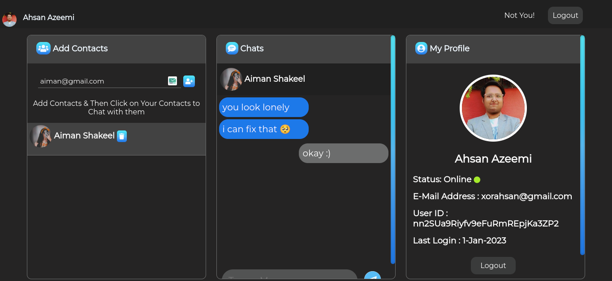

# Texting Pro — My First Chat App

Welcome to Texting Pro — my first chat app, a real-time messaging application built with Firebase Firestore and Firebase Facebook authentication. I created this app when I was 1 years old as a way to learn and grow as a developer. I wanted to build something that people could actually use and interact with, and I hope that this chat app can serve as a source of inspiration for other young developers who are just starting out.
 
Live URL: [Texting Pro Chat App](https://texting-pro.web.app/)

## Features

- Real-time messaging with Firebase Firestore
- Facebook authentication with Firebase
- Aesthetic user interface

## Screenshots

## Getting Started

1. Clone the repository: `git clone https://github.com/xorahsan/Texting-Pro.git`
2. Navigate to the directory: `cd 'Texting-Pro'`
3. Install dependencies: `npm install`
4. Start the development server: `npm start`

## Built With

- [Firebase Firestore](https://firebase.google.com/docs/firestore) - Real-time database
- [Firebase Facebook Authentication](https://firebase.google.com/docs/auth/web/facebook-login) - Facebook login integration
- [Vanilla JS](http://vanilla-js.com/) - Vanilla Javascript

## Inspiration

I was inspired to build this chat app because I wanted to create something that people could actually use and interact with. As a young developer, I was motivated to learn and grow through building real-world projects, and this chat app was a great opportunity to do so.

## Special Thanks

I want to give a special thanks to my teachers and parents. Without their guidance and support, this chat app would not have been possible.

## License

This project is licensed under the [MIT] License - see the [LICENSE](LICENSE) file for details.
